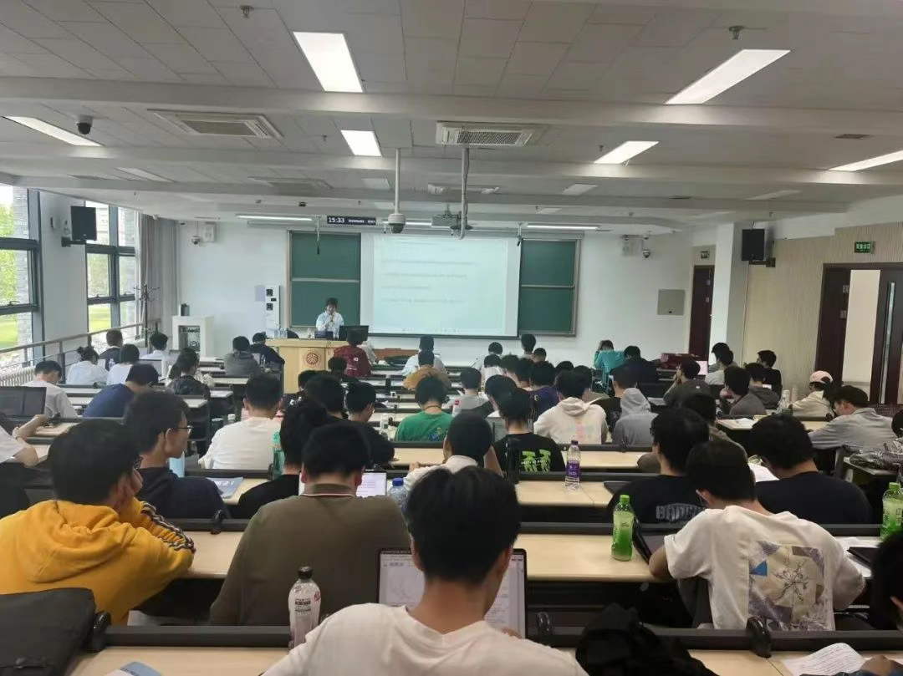
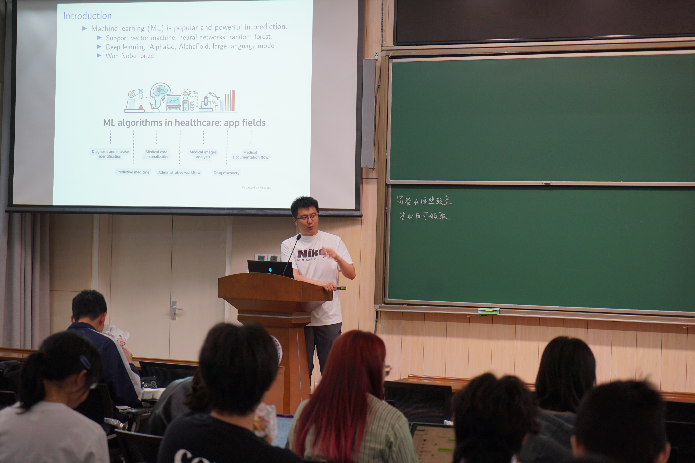

<!-- 卡片HTML结构 -->

  
现任北京大学数学科学学院学生会学术文化部负责人，主要负责组织策划各类学术活动。

  <h2>部门负责人与骨干合影</h2>
  

    
    
点击查看下一张

  

  
欢迎25届同学的加入~

  <h2>学术PIZZA沙龙</h2>
  

    
    
点击查看下一张

  

  
邀请各个方向的知名教授与学生进行深入交流，旨在增进本科生对该学科前沿的理解，创造教授与优秀本科生接触的机会。

  
<a href="https://mp.weixin.qq.com/s/iOXUw8gkEC_21nQI1v9mNw" target="_blank">微信公众号链接</a>

  <h2>分系讲座 & 手册</h2>
  

    
    
点击查看下一张

  

  
邀请学长学姐分享分系心得，编撰分系手册并举办讲座，旨在帮助同学们明晰分系的方向。

  
<a href="https://mp.weixin.qq.com/s/9Hzq6mEnws0g_nM5ga_dyA" target="_blank">微信公众号链接</a>

  <h2>数学一小时</h2>
  

    
    
点击查看下一张

  

  
邀请著名教授讲授一小时左右的前沿内容，旨在帮助有志于学术的同学们增长见识，拓宽视野。

  
<a href="https://mp.weixin.qq.com/s/knU5n7UCmgGGTyo3CiXoaA" target="_blank">微信公众号链接</a>

  
<strong>备注：</strong> 除以上活动外，学术组还举办了 <strong>双学位讲座、四推模拟面试、模拟期中考试、赴饭空间</strong> 等活动。也欢迎其他同学加入 <strong>学术文化部学术组！</strong>

